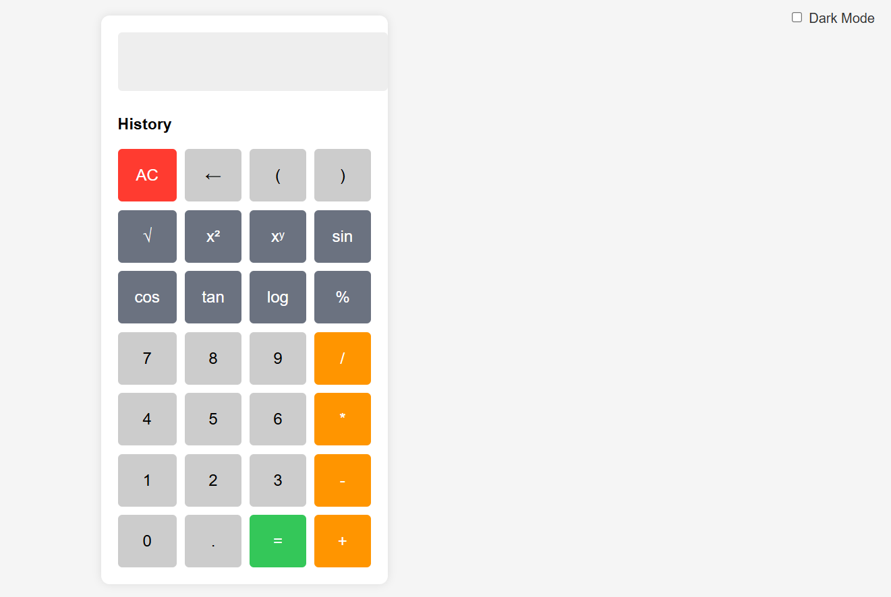

# 🔢 Scientific Calculator

This is a simple and functional scientific calculator built using HTML, CSS, and JavaScript. It supports both basic arithmetic and advanced scientific operations with real calculator-like behavior.

---

## 🔧 Features

- Basic operations: addition (+), subtraction (−), multiplication (×), division (÷)
- Scientific functions: square root (√), square (x²), power (xʸ), sin, cos, tan, log
- Correct percentage calculations (e.g. `100 - 5% = 95`)
- Dark mode toggle
- Calculation history panel
- Keyboard input support
- Mobile responsive layout

---

## 🛠 How to Use

1. Download or clone this repository
2. Open `index.html` in any web browser
3. Use the buttons or your keyboard to perform calculations

---

## 📁 Project Files

- `index.html` – Structure of the calculator
- `stylecalculator.css` – Styles and dark mode
- `scriptcalculator.js` – Calculator logic and functionality
- `README.md` – Project overview (this file)

---

## 🌐 Live Demo

You can host this on GitHub Pages or any static hosting platform.  
Example:  
`https://keshavkumar6.github.io/scientific-calculator/`

---

## 🙌 Credits

Built using plain HTML, CSS, and JavaScript.  
Math calculations are powered by the [math.js](https://mathjs.org/) library.

---

## 📄 License

This project is licensed under the MIT License – you are free to use and modify it.

---

Made with ❤️ by [Your Name](https://github.com/keshavkumar6)
